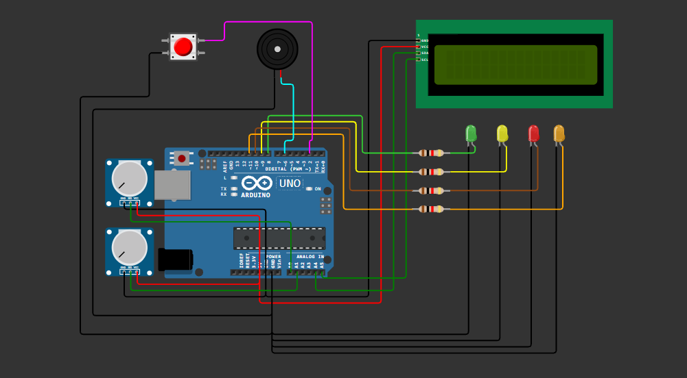

<div align="center">

# 📡 AstraNode

### ⚙️ Estação Inteligente de Monitoramento de Conectividade Via Satélite


</div>

---

# 📖 Sobre o Projeto

Imagine uma comunidade rural que depende integralmente de internet via satélite para realizar atividades essenciais como aulas remotas, telemedicina, agricultura digital e acesso a serviços públicos.

Quando ocorrem falhas de conectividade, muitas vezes não existem ferramentas simples que permitam identificar rapidamente o problema, entender o nível de criticidade da rede e apoiar a tomada de decisão.

O **AstraNode** foi desenvolvido para simular uma estação inteligente de monitoramento de conectividade via satélite, capaz de acompanhar a qualidade da conexão, identificar situações críticas, gerar alertas e auxiliar na priorização de serviços essenciais.

O projeto faz parte da solução **AstraLink**, uma plataforma criada para apoiar a gestão da conectividade em comunidades remotas.

---

# ❗ Por que isso é importante?

A conectividade é um fator essencial para o desenvolvimento social, econômico e educacional de regiões afastadas.

Falhas de comunicação podem impactar diretamente:

<div align="center">

🏫 Educação
🏥 Saúde
🌾 Agricultura
🌎 Inclusão Digital
📡 Comunicação de Emergência

</div>

Por isso, foi desenvolvido um sistema capaz de transformar dados técnicos de conectividade em alertas simples, visuais e acionáveis.

---

# 🖼️ Projeto Montado

<div align="center">



### 📡 Circuito desenvolvido no Wokwi utilizando Arduino UNO, LCD, LEDs, Buzzer, Botão e Sensores Simulados

</div>

---

# 🎯 Objetivo da Solução

O **AstraNode** tem como objetivo monitorar condições de conectividade em comunidades remotas conectadas via satélite, permitindo identificar falhas, gerar alertas e auxiliar gestores na priorização de recursos críticos.

A solução demonstra como tecnologias de **Edge Computing** podem apoiar a gestão da infraestrutura digital em regiões que dependem de comunicações espaciais.

---

# 🧠 Como o Sistema Funciona?

O sistema trabalha em cinco etapas principais.

---

## 🥇 1. Monitoramento da Conectividade

O sistema realiza a leitura contínua dos indicadores simulados:

* qualidade do sinal via satélite;
* quantidade de usuários conectados;
* prioridade operacional da rede.

---

## 🥈 2. Processamento Inteligente

O Arduino processa as informações recebidas e calcula um índice de conectividade.

Com base nos valores monitorados, a rede é classificada como:

* Estável;
* Instável;
* Crítica.

---

## 🥉 3. Priorização de Serviços

O sistema permite alternar entre diferentes prioridades operacionais:

* Educação;
* Saúde;
* Agricultura;
* Uso Geral.

Cada prioridade utiliza critérios específicos para avaliar a qualidade da rede.

---

## 🏅 4. Simulação de Eventos Solares

O AstraNode simula interferências causadas por eventos solares, representando situações que podem impactar comunicações via satélite.

Durante esses eventos, a qualidade da conexão é reduzida e alertas são gerados automaticamente.

---

## 🏁 5. Monitoramento em Tempo Real

Todas as informações são processadas e apresentadas em tempo real através de LEDs, display LCD e alertas sonoros.

---

# 🔍 Entendendo os Componentes

---

## 🔌 Arduino UNO

É o cérebro do sistema.

Responsável por:

* processar os dados;
* controlar LEDs;
* gerar alertas;
* exibir informações no LCD;
* executar toda a lógica do projeto.

---

## 🎛️ Potenciômetro 1

Simula a intensidade do sinal da internet via satélite.

Quanto maior o valor, melhor a qualidade da conexão.

---

## 👥 Potenciômetro 2

Simula a quantidade de usuários conectados à rede.

Quanto maior o número de usuários, maior o consumo da infraestrutura disponível.

---

## 📟 Display LCD I2C

Exibe:

* comunidade monitorada;
* status da conexão;
* prioridade operacional;
* alertas do sistema;
* eventos solares.

---

## 💡 LEDs Inteligentes

| Cor         | Significado             |
| ----------- | ----------------------- |
| 🟢 Verde    | Rede Estável            |
| 🟡 Amarelo  | Rede Instável           |
| 🔴 Vermelho | Rede Crítica            |
| 🟠 Laranja  | Alteração de Prioridade |

---

## 🔊 Buzzer

Responsável por emitir alertas sonoros sempre que situações críticas forem identificadas.

---

## 🔘 Botão de Controle

Permite alternar entre as prioridades operacionais monitoradas pelo sistema.

---

# ⚙️ Componentes Utilizados

<div align="center">

| Componente        | Função                   |
| ----------------- | ------------------------ |
| 🔌 Arduino Uno    | Controle principal       |
| 📟 LCD I2C        | Exibição das informações |
| 🎛️ Potenciômetro | Simulação do sinal       |
| 👥 Potenciômetro  | Simulação de usuários    |
| 💡 LEDs           | Alertas visuais          |
| 🔊 Buzzer         | Alerta sonoro            |
| 🔘 Push Button    | Controle de prioridade   |
| 🧩 Protoboard     | Organização do circuito  |
| 🔗 Jumpers        | Conexões                 |

</div>

---

# 🔌 Estrutura do Circuito

<div align="center">

| Componente                | Pino no Arduino |
| ------------------------- | --------------- |
| LCD I2C - SDA             | A4              |
| LCD I2C - SCL             | A5              |
| Potenciômetro do Sinal    | A0              |
| Potenciômetro de Usuários | A1              |
| LED Verde                 | D8              |
| LED Amarelo               | D9              |
| LED Vermelho              | D10             |
| LED Laranja               | D11             |
| Buzzer                    | D6              |
| Push Button               | D2              |

</div>

---

# 🚨 Funcionamento do Sistema

## 📡 Qualidade da Conexão

| Situação      | Ação                     |
| ------------- | ------------------------ |
| Rede Estável  | 🟢 LED Verde             |
| Rede Instável | 🟡 LED Amarelo           |
| Rede Crítica  | 🔴 LED Vermelho + Buzzer |

---

## 🏫 Prioridades Operacionais

| Prioridade  | Objetivo                                |
| ----------- | --------------------------------------- |
| Educação    | Garantir aulas e conteúdos online       |
| Saúde       | Priorizar telemedicina e atendimentos   |
| Agricultura | Suportar sensores e monitoramento rural |
| Geral       | Utilização padrão da rede               |

---

## ☀️ Evento Solar

Durante a simulação de eventos solares:

* a qualidade da conexão é reduzida;
* o sistema gera alertas;
* o monitoramento registra possíveis impactos na rede.

---

# 🧠 Exemplo da Lógica Utilizada

```cpp
int indice = sinal - (usuarios / 2);

if (indice >= limiteVerde) {
  // Rede Estável
}
else if (indice >= limiteAmarelo) {
  // Rede Instável
}
else {
  // Rede Crítica
}
```

O Arduino toma decisões automaticamente utilizando lógica condicional e processamento local dos dados.

---

# 💻 Código Fonte

O código completo do projeto está disponível no arquivo principal do repositório e também pode ser visualizado abaixo.

```cpp
#include <Wire.h>
#include <LiquidCrystal_I2C.h>

LiquidCrystal_I2C lcd(0x27, 16, 2);

// LEDs
const int ledVerde = 8;
const int ledAmarelo = 9;
const int ledVermelho = 10;
const int ledPrioridade = 11;

// Buzzer
const int buzzer = 6;

// Botão
const int botao = 2;

// Potenciômetros
const int sinalPin = A0;
const int usuariosPin = A1;

// Prioridades
String prioridades[] = {
  "ESCOLA",
  "SAUDE",
  "AGRICULTURA",
  "GERAL"
};

int prioridadeAtual = 3;

// Comunidades
String comunidades[] = {
  "SERRA AZUL",
  "VALE VERDE",
  "BOA VISTA",
  "FAZENDA SOL"
};

int comunidadeAtual = 0;

// Controle de tempo
unsigned long ultimaTrocaComunidade = 0;
unsigned long ultimoEventoSolar = 0;
unsigned long ultimoClique = 0;

const unsigned long intervaloComunidade = 15000;
const unsigned long intervaloEventoSolar = 30000;
const unsigned long duracaoEventoSolar = 8000;

bool eventoSolarAtivo = false;
unsigned long inicioEventoSolar = 0;

bool ultimoEstadoBotao = HIGH;

// Estatísticas
int incidentes = 0;
bool estavaCritico = false;

int leiturasTotais = 0;
int leiturasBoas = 0;

void setup() {
  pinMode(ledVerde, OUTPUT);
  pinMode(ledAmarelo, OUTPUT);
  pinMode(ledVermelho, OUTPUT);
  pinMode(ledPrioridade, OUTPUT);
  pinMode(buzzer, OUTPUT);
  pinMode(botao, INPUT_PULLUP);

  lcd.init();
  lcd.backlight();

  lcd.setCursor(0, 0);
  lcd.print("ASTRALINK");
  lcd.setCursor(0, 1);
  lcd.print("AstraNode System");

  delay(2500);
  lcd.clear();
}

void loop() {
  int sinalRaw = analogRead(sinalPin);
  int usuariosRaw = analogRead(usuariosPin);

  int sinal = map(sinalRaw, 0, 1023, 0, 100);
  int usuarios = map(usuariosRaw, 0, 1023, 0, 100);

  verificarBotao();
  trocarComunidadeAutomaticamente();
  controlarEventoSolar();

  int indice = calcularIndice(sinal, usuarios);

  if (eventoSolarAtivo) {
    indice -= 20;
    if (indice < 0) indice = 0;
  }

  int limiteVerde = getLimiteVerde();
  int limiteAmarelo = getLimiteAmarelo();

  desligarIndicadores();

  leiturasTotais++;

  if (indice >= limiteVerde) {
    leiturasBoas++;
    estavaCritico = false;
    redeEstavel(sinal, usuarios, indice);
  } 
  else if (indice >= limiteAmarelo) {
    estavaCritico = false;
    redeInstavel(sinal, usuarios, indice);
  } 
  else {
    if (!estavaCritico) {
      incidentes++;
      estavaCritico = true;
    }
    redeCritica(sinal, usuarios, indice);
  }

  delay(300);
}

void verificarBotao() {
  bool estadoBotao = digitalRead(botao);

  if (estadoBotao == LOW &&
      ultimoEstadoBotao == HIGH &&
      millis() - ultimoClique > 300) {

    prioridadeAtual++;

    if (prioridadeAtual > 3) {
      prioridadeAtual = 0;
    }

    ultimoClique = millis();

    digitalWrite(ledPrioridade, HIGH);

    lcd.clear();
    lcd.setCursor(0, 0);
    lcd.print("PRIORIDADE:");
    lcd.setCursor(0, 1);
    lcd.print(prioridades[prioridadeAtual]);

    tone(buzzer, 1500, 120);

    delay(1200);
  }

  ultimoEstadoBotao = estadoBotao;
}

void trocarComunidadeAutomaticamente() {
  if (millis() - ultimaTrocaComunidade >= intervaloComunidade) {
    comunidadeAtual++;

    if (comunidadeAtual > 3) {
      comunidadeAtual = 0;
    }

    ultimaTrocaComunidade = millis();

    lcd.clear();
    lcd.setCursor(0, 0);
    lcd.print("COMUNIDADE:");
    lcd.setCursor(0, 1);
    lcd.print(comunidades[comunidadeAtual]);

    tone(buzzer, 1200, 100);

    delay(1200);
  }
}

void controlarEventoSolar() {
  if (!eventoSolarAtivo && millis() - ultimoEventoSolar >= intervaloEventoSolar) {
    eventoSolarAtivo = true;
    inicioEventoSolar = millis();
    ultimoEventoSolar = millis();

    lcd.clear();
    lcd.setCursor(0, 0);
    lcd.print("EVENTO SOLAR");
    lcd.setCursor(0, 1);
    lcd.print("INTERFERENCIA");

    digitalWrite(ledVermelho, HIGH);
    tone(buzzer, 700, 700);

    delay(1600);
  }

  if (eventoSolarAtivo && millis() - inicioEventoSolar >= duracaoEventoSolar) {
    eventoSolarAtivo = false;

    lcd.clear();
    lcd.setCursor(0, 0);
    lcd.print("EVENTO SOLAR");
    lcd.setCursor(0, 1);
    lcd.print("NORMALIZADO");

    tone(buzzer, 1400, 150);

    delay(1200);
  }
}

int calcularIndice(int sinal, int usuarios) {
  int penalidadeUsuarios = usuarios / 2;
  int indice = sinal - penalidadeUsuarios;

  if (indice < 0) {
    indice = 0;
  }

  return indice;
}

int getLimiteVerde() {
  switch (prioridadeAtual) {
    case 0: return 60; // ESCOLA
    case 1: return 80; // SAUDE
    case 2: return 70; // AGRICULTURA
    case 3: return 70; // GERAL
  }

  return 70;
}

int getLimiteAmarelo() {
  switch (prioridadeAtual) {
    case 0: return 35; // ESCOLA
    case 1: return 60; // SAUDE
    case 2: return 45; // AGRICULTURA
    case 3: return 40; // GERAL
  }

  return 40;
}

void desligarIndicadores() {
  digitalWrite(ledVerde, LOW);
  digitalWrite(ledAmarelo, LOW);
  digitalWrite(ledVermelho, LOW);
  digitalWrite(ledPrioridade, LOW);
  noTone(buzzer);
}

void redeEstavel(int sinal, int usuarios, int indice) {
  digitalWrite(ledVerde, HIGH);

  lcd.clear();
  lcd.setCursor(0, 0);
  lcd.print(comunidades[comunidadeAtual]);

  lcd.setCursor(0, 1);
  lcd.print("OK S:");
  lcd.print(sinal);
  lcd.print("% U:");
  lcd.print(usuarios);
  lcd.print("%");
}

void redeInstavel(int sinal, int usuarios, int indice) {
  digitalWrite(ledAmarelo, HIGH);

  lcd.clear();
  lcd.setCursor(0, 0);
  lcd.print(comunidades[comunidadeAtual]);

  lcd.setCursor(0, 1);

  if (eventoSolarAtivo) {
    lcd.print("SOLAR ");
  } else {
    lcd.print("INST ");
  }

  lcd.print(prioridades[prioridadeAtual]);
  lcd.print(" I:");
  lcd.print(indice);
}

void redeCritica(int sinal, int usuarios, int indice) {
  digitalWrite(ledVermelho, HIGH);

  if (eventoSolarAtivo) {
    tone(buzzer, 700);
  } else {
    tone(buzzer, 900);
  }

  lcd.clear();
  lcd.setCursor(0, 0);
  lcd.print(comunidades[comunidadeAtual]);

  lcd.setCursor(0, 1);
  lcd.print("CRIT ");

  if (eventoSolarAtivo) {
    lcd.print("SOLAR ");
  } else {
    lcd.print("INC:");
    lcd.print(incidentes);
    lcd.print(" ");
  }

  lcd.print("I:");
  lcd.print(indice);
}
```

---

# ▶️ Instruções de Execução

Para executar o projeto:

1. Acesse o link da simulação no Wokwi.
2. Clique no botão **Start Simulation**.
3. Gire o primeiro potenciômetro para alterar a qualidade do sinal.
4. Gire o segundo potenciômetro para alterar a quantidade de usuários conectados.
5. Pressione o botão para alternar entre as prioridades operacionais.
6. Observe os LEDs, o LCD e o buzzer reagindo automaticamente.
7. Aguarde a simulação de evento solar ocorrer automaticamente.

---

# 🛠️ Tecnologias Utilizadas

<div align="center">


</div>

---

# 🔗 Acesse o Projeto

<div align="center">

## 👉 Simulação no Wokwi

https://wokwi.com/projects/465399389626208257

## 👉 Vídeo Explicativo

COLOCAR_LINK_VIDEO

</div>

---

# 👨‍💻 Equipe de Desenvolvimento

<div align="center">

| Integrante     | RM     |
| -------------- | ------ |
| Beatriz Perigo | 569654 |
| Fabricio Denig | 570980 |
| Rafael Sobral  | 569527 |

</div>

---

# 🏫 Contexto Acadêmico

Projeto desenvolvido para a **Global Solution 2026** da disciplina de **Edge Computing & Computer Systems** da FIAP.

A solução foi criada com o objetivo de demonstrar a aplicação de conceitos de **Edge Computing**, **IoT** e **monitoramento inteligente** em cenários de conectividade via satélite para comunidades remotas.

---

<div align="center">

# 📡 Obrigado por visitar o AstraNode!

### Conectando comunidades através da tecnologia espacial.

</div>
